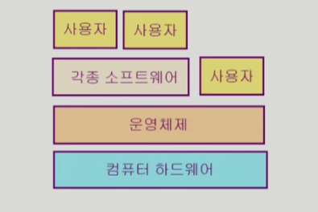
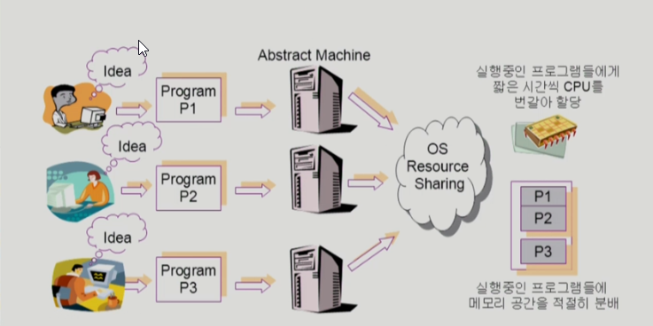
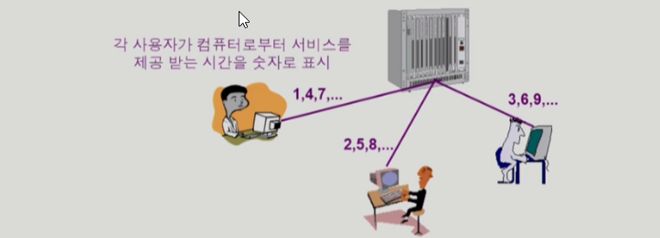

# 운영체제 - 반효경 교수 강의
내용별 정리 - [Velog](https://velog.io/@wwh11111/series/OS)

***

## 운영체제 개요

### 운영체제란?
- 컴퓨터 하드웨어 바로 위에 설치되어 사용자 및 다른 모든 소프트웨어와 하드웨어를 연결하는 소프트웨어 계층
- 협의의 운영체제(커널)
    - 운영체제의 핵심 부분으로 메모리에 상주하는 부분
- 광의의 운영체제
    - 커널 뿐 아니라 각종 주변 시스템 유틸리티를 포함한 개념

### 운영 체제의 목표
1. 컴퓨터 시스템을 편리하게 사용할 수 있는 환경 제공
    - 운영체제는 동시 사용자/프로그램들이 각각 독자적 컴퓨터에서 수행되는 것처럼 느끼게끔
    - 하드웨어를 직접 다루는 복잡한 부분을 운영체제가 대행

2. 컴퓨터 시스템의 **자원을 효율적으로 관리**
    - 프로세서, 기억장치, 입출력 장치 등의 효율적 관리
    - 프로세스, 파일, 메시지 등 관리

### 운영 체제의 분류
#### 동시 작업 가능 여부
1. 단일 작업(single tasking)
    - 한 번에 하나의 작업만 처리

2. 다중 작업(multi tasking)
    - 동시에 두 개 이상의 작업 처리

#### 사용자 수
1. 단일 사용자

2. 다중 사용자

#### 처리 방식
1. 일괄 처리(batch processing)
    - 작업 요청의 일정량 모아서 한꺼번에 처리
    - 작업이 완전 종료될 때까지 대기

2. 시분할(time sharing)
    - 여러 작업을 수행할 때 컴퓨터 처리 능력을 일정 시간 단위로 분할하여 사용
    - 일괄 처리 시스템에 비해 짧은 응답 시간
        - 예) UNIX
    - interactive한 방식

3. 실시간(Realtime OS)
    - 정해진 시간 안에 어떠한 일이 반드시 종료됨이 보장되어야 함
        - 예) 공장 제어, 미사일 제어, 반도체, 로봇 제어

### 용어 구분
- Multitasking
- Multiprogramming
- Time sharing
- Multiprocess
- 구분
    - 위 용어들은 컴퓨터에서 여러 작업을 동시에 수행하는 것 의미
    - Multiprogramming은 여러 프로그램이 메모리에 올라가 있음을 강조
    - Time sharing은 CPU의 시간을 분할하여 나눠 쓴다는 의미 강조
- Multiprocessor - 하나의 컴퓨터에 CPU(processor)가 여러 개 붙어 있는 것 의미

### 운영 체제 예
#### UNIX
- 코드 대부분을 C언어로 작성
- 높은 이식성
- 최소한의 커널 구조
- 복잡한 시스템에 맞게 확장 용이
- 소스 코드 공개
- 프로그램 개발에 용이
- 다양한 버전
    - 예시) System V, FreeBSD, SunOS, Solaris, Linux

#### DOS
- MS사에서 개발
- 단일 사용자용 운영 체제, 메모리 관리 능력의 한계

#### MS Windows
- MS사의 다중 작업용 GUI 기반 운영 체제
- Plug and Play, 네트워크 환경 강화
- DOS용 응용 프로그램과 호환성 제공
- 풍부한 지원 소프트웨어

### 운영 체제의 구조

