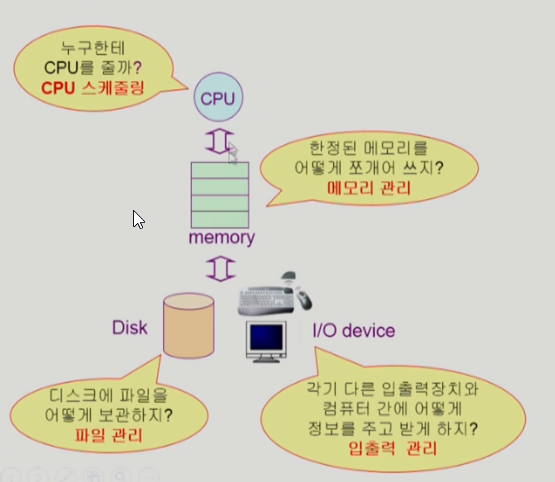
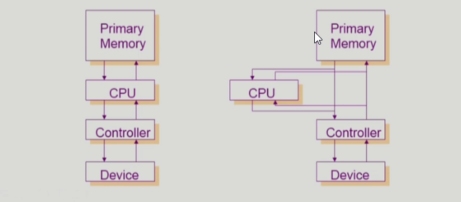
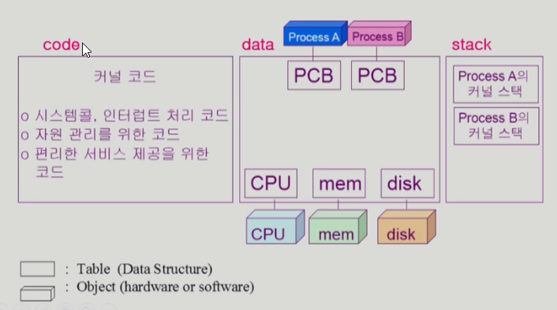

# 운영체제 - 반효경 교수 강의
내용별 정리 - [Velog](https://velog.io/@wwh11111/series/OS)

***

## 운영체제 개요

### 운영체제란?
- 컴퓨터 하드웨어 바로 위에 설치되어 사용자 및 다른 모든 소프트웨어와 하드웨어를 연결하는 소프트웨어 계층
- 협의의 운영체제(커널)
    - 운영체제의 핵심 부분으로 메모리에 상주하는 부분
- 광의의 운영체제
    - 커널 뿐 아니라 각종 주변 시스템 유틸리티를 포함한 개념

### 운영 체제의 목표
1. 컴퓨터 시스템을 편리하게 사용할 수 있는 환경 제공
    - 운영체제는 동시 사용자/프로그램들이 각각 독자적 컴퓨터에서 수행되는 것처럼 느끼게끔
    - 하드웨어를 직접 다루는 복잡한 부분을 운영체제가 대행

2. 컴퓨터 시스템의 **자원을 효율적으로 관리**
    - 프로세서, 기억장치, 입출력 장치 등의 효율적 관리
    - 프로세스, 파일, 메시지 등 관리

### 운영 체제의 분류
#### 동시 작업 가능 여부
1. 단일 작업(single tasking)
    - 한 번에 하나의 작업만 처리

2. 다중 작업(multi tasking)
    - 동시에 두 개 이상의 작업 처리

#### 사용자 수
1. 단일 사용자

2. 다중 사용자

#### 처리 방식
1. 일괄 처리(batch processing)
    - 작업 요청의 일정량 모아서 한꺼번에 처리
    - 작업이 완전 종료될 때까지 대기

2. 시분할(time sharing)
    - 여러 작업을 수행할 때 컴퓨터 처리 능력을 일정 시간 단위로 분할하여 사용
    - 일괄 처리 시스템에 비해 짧은 응답 시간
        - 예) UNIX
    - interactive한 방식

3. 실시간(Realtime OS)
    - 정해진 시간 안에 어떠한 일이 반드시 종료됨이 보장되어야 함
        - 예) 공장 제어, 미사일 제어, 반도체, 로봇 제어

### 용어 구분
- Multitasking
- Multiprogramming
- Time sharing
- Multiprocess
- 구분
    - 위 용어들은 컴퓨터에서 여러 작업을 동시에 수행하는 것 의미
    - Multiprogramming은 여러 프로그램이 메모리에 올라가 있음을 강조
    - Time sharing은 CPU의 시간을 분할하여 나눠 쓴다는 의미 강조
- Multiprocessor - 하나의 컴퓨터에 CPU(processor)가 여러 개 붙어 있는 것 의미

### 운영 체제 예
#### UNIX
- 코드 대부분을 C언어로 작성
- 높은 이식성
- 최소한의 커널 구조
- 복잡한 시스템에 맞게 확장 용이
- 소스 코드 공개
- 프로그램 개발에 용이
- 다양한 버전
    - 예시) System V, FreeBSD, SunOS, Solaris, Linux

#### DOS
- MS사에서 개발
- 단일 사용자용 운영 체제, 메모리 관리 능력의 한계

#### MS Windows
- MS사의 다중 작업용 GUI 기반 운영 체제
- Plug and Play, 네트워크 환경 강화
- DOS용 응용 프로그램과 호환성 제공
- 풍부한 지원 소프트웨어

### 운영 체제의 구조

***

## 시스템 구조 & 프로그램 실행

### Mode bit
- 사용자 프로그램의 잘못된 수행으로 다른 프로그램 및 운영체제에 피해가 가지 않도록 하기 위한 보호 장치 필요
- **Mode bit**을 통해 하드웨어적으로 두 가지 모드의 operation 지원
    - 1 : 사용자 모드 - 사용자 프로그램 수행
    - 0 : 모니터 모드 - OS 코드 수행
    - 보안을 해칠 수 있는 중요할 명령어는 모니터 모드에서만 수행 가능한 특권명령으로  규정
    - Interrupt나 Exception 발생 시 하등 ㅞ어가 mode bit을 0으로 변경
    - 사용자 프로그램에게 CPU를 넘기기 전에 mode bit을 1로 세팅

### Timer
- 정해진 시간이 흐른 뒤 운영체제에게 제어권이 넘어가도록 인터럽트 발생시킴
- 타이머는 매 클럭 틱 때마다 1씩 감소
- 타이머 값이 0이 되면 타이머 인터럽트 발생
- CPU를 특정 프로그램이 독점하는 것으로부터 보호
- 타이머는 **time sharing** 구현에 널리 이용
- 타이머는 현재 시간을 계산하기 위해서도 사용

### Device Controller
- I/O device controller
    - 해당 I/O 장치유형을 관리하는 일종의 작은 CPU
    - 제어 정보를 위해 control register, status register 가짐
    - local buffer 가짐(일종의 data register)
- I/O는 실제 device와 local buffer 사이에서 일어남
- Device controller는 I/O가 끝났을 경우 interrupt로 CPU에 그 사실을 알림
- device driver(장치구동기) : OS 코드 중 각 장치별 처리루틴 -> software
- device controller(장치제어기) : 각 장치를 통제하는 일종의 작은 CPU -> hardware

### I/O(입출력) 수행
- 모든 입출력 명령은 특권 명령
- 사용자 프로그램이 I/O 하는 방법
    - 시스템콜(system call) : 사용자 프로그램은 운영체제에게 I/O 요청
    - trap을 사용하여 인터럽트 벡터의 특정 위치로 이동
    - 제어권이 인터럽트 벡터가 가리키는 인터럽트 서비스 루틴으로 이동
    - 올바른 I/O 요청인지 확인 후 I/O 수행
    - I/O 완료 시 제어권을 시스템콜 다음 명령으로 옮김

### 인터럽트(Interrupt)
- 인터럽트
    - 인터럽트 당한 시점의 레지스터와 program counter를 save한 후 CPU의 제어를 인터럽트 처리 루틴에 넘김
#### Interrupt(넓은 의미)
- Interrupt(하드웨어 인터럽트) : 하드웨어가 발생시킨 인터럽트
- Trap(소프트웨어 인터럽트)
    - Exception: 프로그램이 오류를 범한 경우
    - System call: 프로그램이 커널 함수를 호출하는 경우
- 인터럽트 관련 용어
    - 인터럽트 벡터 : 해당 인터럽트의 처리 루틴 주소를 가지고 있음
    - 인터럽트 처리 루틴(Interrupt Service Routine, 인터럽트 핸들러) : 해당 인터럽트를 처리하는 커널 함수

### 시스템콜
- 사용자 프로그램이 운영체제의 서비스를 받기 위해 커널 함수를 호출하는 것

### 동기식 입출력 / 비동기식 입출력
#### 동기식 입출력(synchronous I/O)
- I/O 요청 후 입출력 작업이 완료된 후에야 제어가 사용자 프로그램에 넘어감
- 구현 방법 1
    - I/O가 끝날 때까지 CPU를 낭비시킴
    - 매 시점 하나의 I/O만 일어날 수 있음
- 구현 방법 2
    - I/O가 완료될 때까지 해당 프로그램에게서 CPU를 뺴앗음
    - I/O 처리를 기다리는 줄에 그 프로그램을 줄 세움
    - 다른 프로그램에게 CPU를 줌
#### 비동기식 입출력(asynchronous I/O)
- I/O가 시작된 후 입출력 작업이 끝나기를 기다리지 않고 제어가 사용자 프로그램에 즉시 넘어감

- 두 경우 모두 I/O의 완료는 인터럽트로 알려줌

| 항목                     | 동기식 I/O               | 비동기식 I/O             |
|--------------------------|--------------------------|--------------------------|
| I/O 동안 프로그램 상태   | 멈춰 있음 (Blocked)      | 멈추지 않음              |
| I/O 완료 전 다음 코드 실행 | ❌ 불가능                 | ✅ 가능                  |
| CPU는 누구에게?          | 다른 프로세스에게 줌     | 내 프로세스 계속 사용 가능 |
| 예시 코드 흐름           | read → 기다림 → print    | aio_read → print → (나중에) 콜백 실행 |

### DMA(Direct Memory Access)
- 빠른 입출력 장치를 메모리에 가까운 속도로 처리하기 위해 사용
- CPU의 중재 없이 device controller가 device의 buffer storage의 내용을 메모리에 block 단위로 직접 전송
- 바이트 단위가 아니라 block 단위로 인터럽트를 발생시킴

### 서로 다른 입출력 명령어
1. I/O를 수행하는 special instruction에 의해
2. Memory Mapped I/O에 의해

### 저장장치 계층 구조

### 프로그램의 실행(memory load)

### 커널 주소 공간의 내용

### 사용자 프로그램이 사용하는 함수
- 사용자 정의 함수
    - 자신이 프로그램에서 정의한 함수
- 라이브러리 함수
    - 자신의 프로그램에서 정의하지 않고 갖다 쓴 함수
    - 자신의 프로그램의 실행 파일에 포함
- 커널 함수
    - 운영체제 프로그램의 함수
    - 커널 함수의 호출 = 시스템 콜

### 프로그램의 실행

